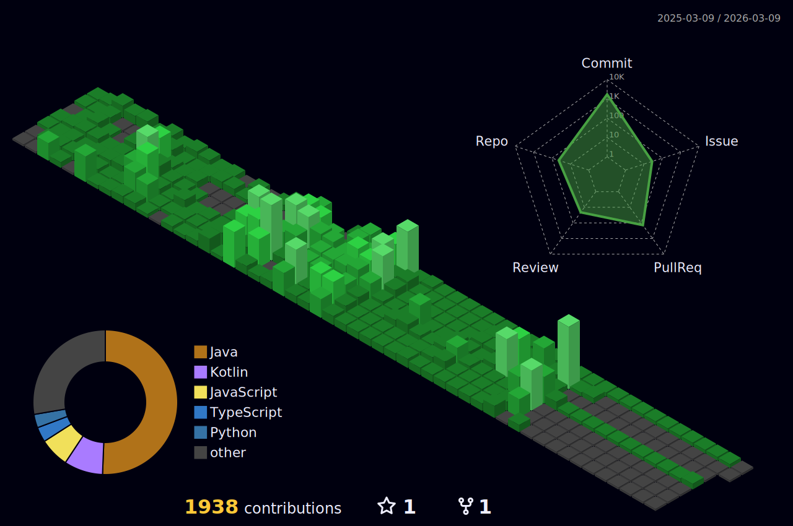

# 🚀 Backend Developer & AI Enthusiast

> **"기술 뿐만이 아닌 비용까지 생각하는 개발자, 협업을 중시하고 모두가 빠른 개발을 할 수 있게 하는 개발자"**

 

## 🪪 About ME
- 🎯 **목표**: 최적의 CPU로 최대의 효율을 지향하는 개발
- 💡 **철학**: 사용자 중심의 안정적이고 확장 가능한 시스템 구축
- 🌱 **성장**: 지속적인 학습과 새로운 기술 도전을 통한 전문성 향상

 

## 🏆 주요 성과
- 🥇 **SW IP 해커톤 최우수상**: AI 위험도 탐지 시스템 개발 및 특허 출원
- 🏆 **멋쟁이사자처럼 최우수상**: 던전톡 TRPG 플랫폼 백엔드 개발 및 AI RAG 구현
- 🏅 **구름톤**: 토이 프로젝트 성공적 완주
- 📱 **AI 일기 앱**: 감정 분석 기반 개인화 서비스 백엔드 
- 🌐 **뉴스 배달 서비스**: 멋쟁이사자처럼 팀 프로젝트 JWT 인증/인가 및 AWS 배포

 

## 🎓 Education

| 기간 | 기관 | 전공/과정 | 역할 |
|------|------|----------|------|
| 2021.03 - 2026.07 (예정) | **대진대학교** | 컴퓨터공학과 | - |
| 2024.12 - 2025.07 | **GDSC 연합 동아리** | 개발자 커뮤니티 | 백엔드 개발자 |
| 2025.06 - 2025.08 | **멋쟁이 사자처럼** | 백엔드 단기 심화 부트캠프 | 수료 |

 

## 🔗 Links

 

## 💻 Tech Stack

### Backend

### Frontend

### Database & Cache

### AI & ML

### DevOps & Cloud

 

## 🎯 Featured Projects

### 🛡️ StreetGuardian - AI 기반 거리 안전도 분석 시스템
- **기간**: 2024년 SW IP 해커톤
- **역할**: 백엔드 개발, AI 모델 연동
- **기술 스택**: Java, Spring Boot, AI/ML
- **성과**: 
  - **🥇 최우수상 수상 & 📋 특허 출원**
  - 실시간 위험도 탐지 알고리즘 구현
  - AI 모델과 백엔드 API 연동 최적화
  - 안전 경로 추천 시스템 개발
- **링크**: [BE 저장소](https://github.com/moonjun1/StreetGuardian)

### 🎮 DungeonTalk - AI GM과 함께하는 멀티 플레이 TRPG 게임
- **기간**: 2024년 멋쟁이사자처럼 2차 프로젝트
- **역할**: 
  - **POC : 사전 기술 검증**
    - Cloudflare AutoRAG
    - Spring AI
  - **큐 시스템 & 매칭 시스템**
    - Redis Queue와 Thread Pool을 활용한 매칭 시스템 개발
  - **시스템 아키텍처**
    - MongoDB 게임방 로그
    - Valkey 캐싱 & 세션
    - FastAPI RAG 구현
- **기술 스택**: Spring Boot, Spring Security, JWT, MongoDB, Valkey, WebSocket, FastAPI, Cloudflare AutoRAG, Nginx, HTTPS
- **성과**: 
  - **🏆 멋쟁이사자처럼 최우수상**
  - **POC를 통한 실제 데이터 기반 프로젝트 방향성 판단**
  - **Redis Queue & Thread Pool 기반 효율적인 매칭 시스템 구현**
  - **Valkey 캐싱으로 응답속도 99.2% 개선**
  - Discord WebHook, GitHub Canvas & Issues 활용
  - Wiki & 팀 Notion 문서화로 팀워크 향상
- **링크**: [BE 저장소](https://github.com/DungeonTalk/dungeontalk-backend) · [DB 저장소](https://github.com/moonjun1/dungeontalk-db) · [Python 저장소](https://github.com/DungeonTalk/python-ai-model)

### 📝 Thinkeep - AI 감정 분석 일기 앱
- **기간**: 2024년 팀 프로젝트
- **역할**: 백엔드 , Git Convention 구축, 코드 리뷰 시스템 운영
- **기술 스택**: Java, Spring Boot, AI 감정 분석, Prometheus, Grafana, JPA, MySQL
- **성과**: 
  - **효율적인 팀워크 경험**
  - Git Convention & 브랜치 전략 설계로 팀 생산성 30% 향상
  - 감정 분석 API 개발 (7가지 감정 분류)
  - Prometheus/Grafana 모니터링 구축
  - 사용자 스트릭 시스템 개발
- **링크**: [BE 저장소](https://github.com/moonjun1/thinkeep_BE_privat)

### 📰 멋쟁이 뉴스 배달부 - 개인 맞춤형 뉴스 배달 서비스
- **기간**: 2025.07.07 - 2025.07.27 (멋쟁이사자처럼 1차 프로젝트)
- **서비스**: 내가 원하는 뉴스를 원하는 시간대에 카톡으로 배달
- **역할**: 
  - 백엔드 개발
  - JWT 인증/인가 시스템
  - **AWS 인프라 구축**
    - Route53 도메인 등록
    - Amplify FE 배포
    - ALB로 트래픽 분산
    - 로컬 MySQL → AWS RDS 마이그레이션
    - Prometheus 모니터링
- **기술 스택**: JWT, OAuth, KakaoTalk API, AWS (Route53, Amplify, ALB, RDS), MySQL, Prometheus, Redis, GitHub Actions
- **성과**: 
  - **위기 상황 극복 & 신속한 문제 해결**
  - 인원 40% 중도이탈 상황에서도 마감기한 준수
  - 출시 후 오류 2시간 만에 임시조치
  - 팀원들과 하루만에 근본적 문제 해결
  - 3주 스프린트 내 기획/구현/배포/에러대응 완료
  - 로컬 MySQL에서 AWS RDS로 무중단 마이그레이션 성공
  - ALB로 프론트엔드-백엔드 트래픽 분산
  - Prometheus 서버상태 실시간 모니터링
- **링크**:   [BE 저장소](https://github.com/moonjun1/News_Server) 

 

 

---

