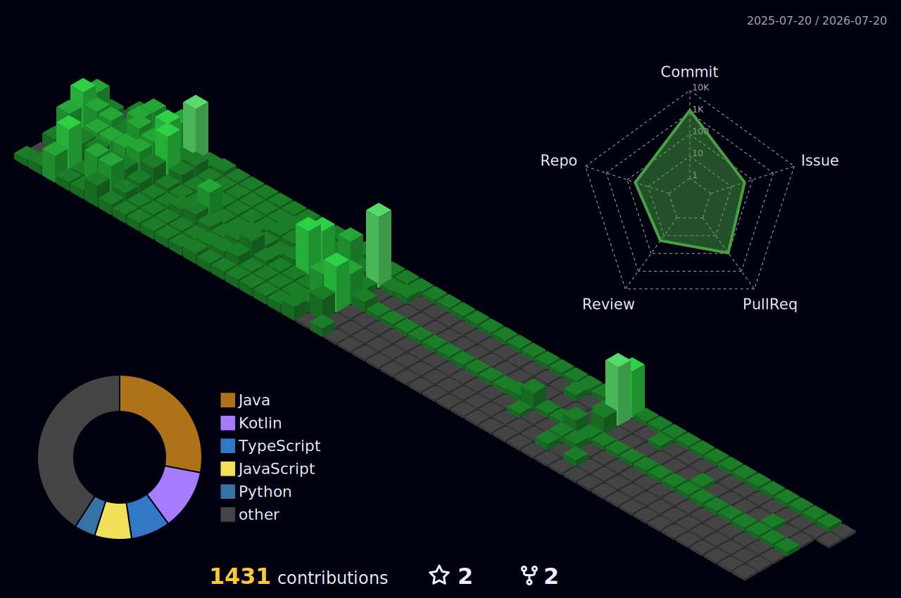

#  Backend Developer

> **"기술 뿐만이 아닌 비용까지 생각하는 개발자, 협업을 중시하고 모두가 빠른 개발을 할 수 있게 하는 개발자를 추구합니다"**

 

##  About ME
-  **목표**: 정확하고 빠른 구현 
-  **철학**: 사용자 중심의 안정적이고 확장 가능한 시스템 구축

 

##  수상
-  **SW IP 해커톤 최우수상**: AI 위험도 탐지 시스템 개발 및 특허 출원
-  **멋쟁이사자처럼 최우수상**: 던전톡 TRPG 플랫폼 백엔드 개발 및 AI RAG 구현

 

##  Education

| 기간 | 기관 | 전공/과정 | 역할 |
|------|------|----------|------|
| 2017.12 ~ 2018.05 | KG아이티뱅크 | IT기초교육 | 수료 | 
| 2021.03 - 2026.07 (예정) | **대진대학교** | 컴퓨터공학과 | - |
| 2024.12 ~ 2026.03| **GDSC 연합 동아리** | 개발자 커뮤니티 | 백엔드 개발자 |
| 2025.06 - 2025.08 | **멋쟁이 사자처럼** | 백엔드 단기 심화 부트캠프 | 수료 |
| 2025.03 - 2025.09 | **구름톤 미르미** | 개발자 커뮤니티 | 수료 |

 

##  Links

 

##  Tech Stack

### Backend

### Frontend

### Database & Cache

### DevOps & Cloud

 

 

 

---

